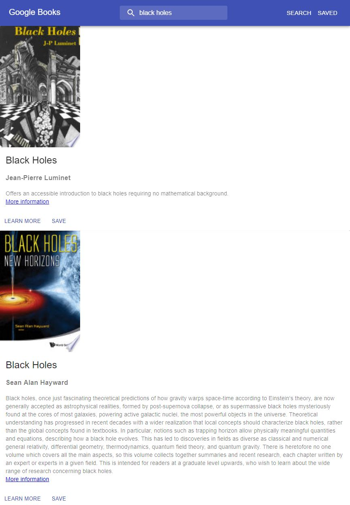

# Google-Books-Search

App that allows users to send requests to Google's Books API in order to receive search results that are most relevant to their search. The search results can be saved for reading later and deleted afterwards. Links are provided for finding out more information on Google's Books site once a search is performed by clicking the search button.




## Getting Started
The following instructions will allow you to clone the project to your machine for testing.

### Installing

Git clone to your local machine:

```
https://github.com/wgbcamp/Google-Books-Search.git
```

### Running Application

cd into the directory that you cloned the application to and install dependencies with:

```
npm install
```

Start the application by first running the mongodb daemon process:

```
mongod
```

Start mongo shell with:

```
mongo
```

Start development environment with:

```
npm run start
```

## Technologies

* MongoDB
* Express.js
* React.js
* Node.js
* NPM
* Material UI react framework
